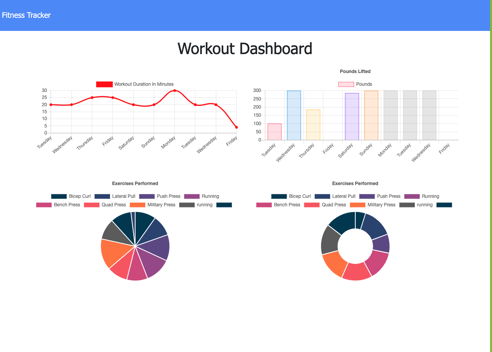
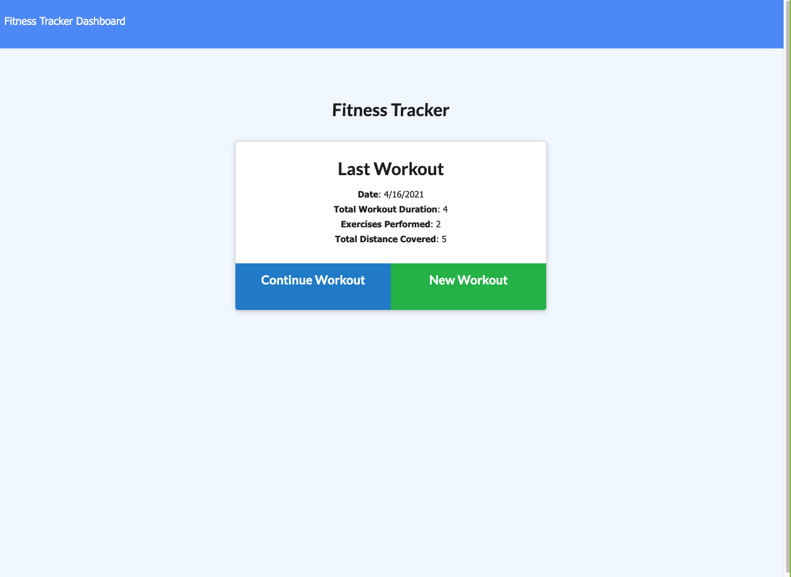

# Fitness-Tracker 

## Description

This app allow a user to view create and track daily workouts.The user is able to log multiple exercises in a workout on a given day; and also the user should be able to track the name, type, weight, sets, reps, and duration of exercise. If the exercise is a cardio exercise, The user should be able to track his or her distance traveled.

### Demo link

[Fitness-tracker](https://workout2021.herokuapp.com/stats)

#### Images

